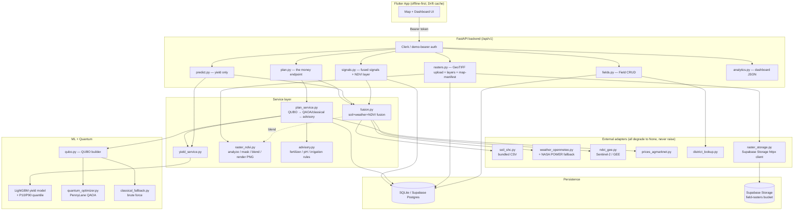
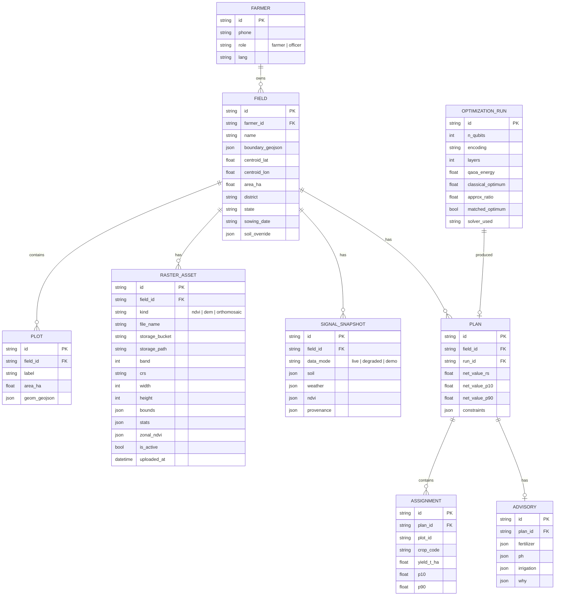
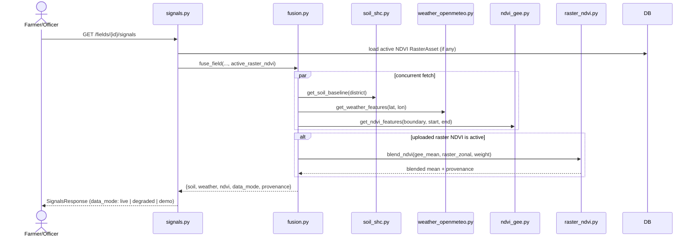
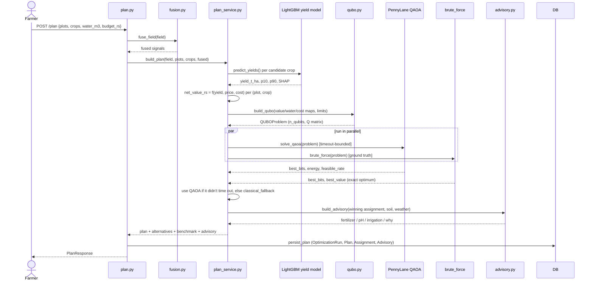
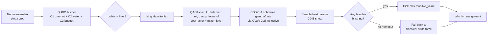
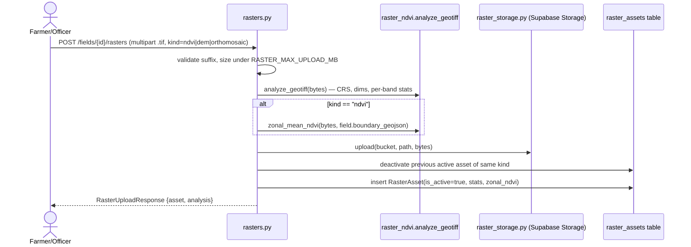
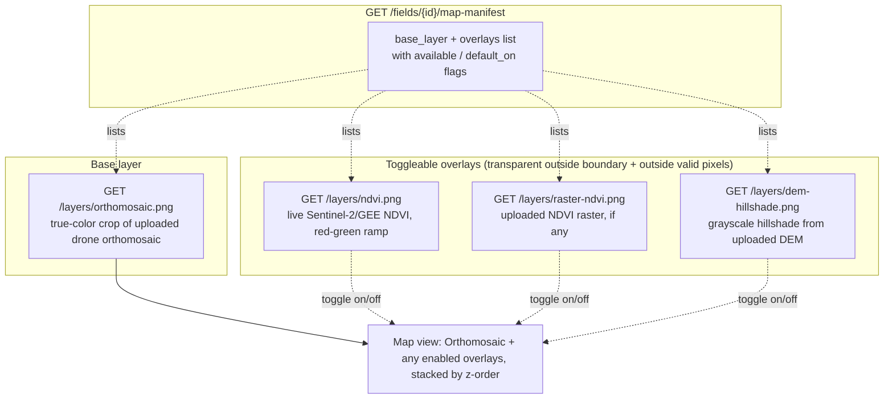
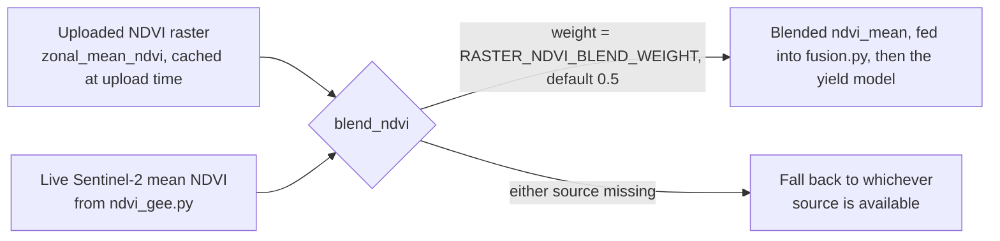
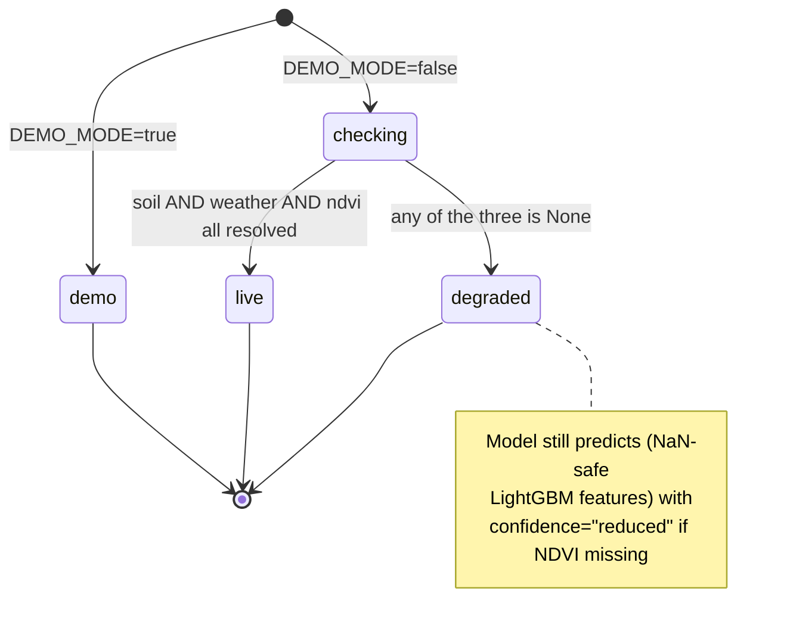

# FarmSync Quantum 2.0 — Architecture & Build Review

Status snapshot of the backend as built. Companion docs: `FARMSYNC_BRIEF.md` (product framing), `PRD.md`, `TRD.md`.

---

## 1. One-line pitch

Zero-hardware data fusion (govt. soil cards + live weather + satellite/drone NDVI) feeds a classical LightGBM yield model; a QAOA quantum optimizer turns those yield predictions into the best crop/resource plan per field, with a deterministic advisory layer on top.

**Hard rule enforced throughout the codebase:** quantum (QAOA) is only ever used for combinatorial *optimization* (crop/resource allocation). Yield *prediction* is 100% classical regression. Pest/disease detection is rule-based NDVI thresholds — no CNN/CV.

---

## 2. Tech stack

| Layer | Choice | Notes |
|---|---|---|
| API | FastAPI 0.141, Python 3.10+ typing | `backend/app/main.py`, versioned under `/api/v1` |
| Auth | Clerk session tokens + `Bearer demo-farmer` / `demo-officer` bypass | Works venue-offline for a demo |
| DB | SQLAlchemy 2.0 ORM → SQLite (dev/demo) or Supabase Postgres (prod) | Same schema both ways; boundary/geometry kept as JSON, not PostGIS, so it runs on SQLite too |
| Object storage | Supabase Storage (private bucket `field-rasters`) | Uploaded GeoTIFF pixel bytes only; metadata lives in Postgres |
| ML | LightGBM (point + P10/P90 quantile boosters), SHAP | `backend/app/ml/`, `backend/models/v1/*` trained artifacts |
| Quantum | PennyLane `default.qubit` simulator, QAOA + CVaR | `backend/app/quantum/` — simulator only, no hardware claim |
| Geospatial | `rasterio`, `shapely`, `Pillow` | GeoTIFF masking/rendering, boundary geometry, PNG overlays |
| External data | Open-Meteo (+ NASA POWER fallback), Google Earth Engine (Sentinel-2), bundled Soil Health Card CSV, Agmarknet price CSV | All degrade to `None` on failure — never raise |
| Mobile client | Flutter (Riverpod, Drift, MapLibre) | Scaffolded (`flutter_app/`); this review covers the backend, which is where this session's work landed |

---

## 3. High-level system architecture

---

## 4. Database schema (ER diagram)

---

## 5. Request/response flow — fused signals (`GET /fields/{id}/signals`)

The three-source fusion that feeds every downstream prediction.

`data_mode` is **derived, never hand-set**: `"demo"` under `DEMO_MODE`, `"live"` only if soil + weather + NDVI all returned real values, `"degraded"` otherwise. An uploaded raster is a *refinement* on top of NDVI, not a fourth required source — its absence never degrades `data_mode`.

---

## 6. The money path — `POST /plan`

### QAOA / QUBO design

- **Decision variables**: one binary `x_(plot, crop)` per (plot, candidate crop) pair.
- **Constraints**: C1 exactly-one-crop-per-plot (equality penalty), C2 water ≤ budget, C3 cash ≤ budget (slack-encoded inequalities, 6–9 qubits at demo scale).
- **Objective**: maximize net value = `yield × area × price × 10 − cost × area`.
- **Solver**: PennyLane `default.qubit` simulator, CVaR-biased COBYLA training (best-quartile of sampled bitstrings), classical brute-force always runs in parallel as ground truth.
- **Verified property**: QAOA recovers the exact brute-force optimum at 6–9 qubit demo scale — the pitch is "quantum-ready", not "quantum-advantage" (no hardware, no speedup claim).

---

## 7. Raster / NDVI pipeline — this session's build

Landroid-style GeoTIFF upload pipeline: pixel bytes in Supabase Storage, metadata + cached zonal stats in Postgres, PNG rendering on-demand via `rasterio.io.MemoryFile` (never touches local disk).

### Toggleable map layers

The orthomosaic is the **base layer**; NDVI (satellite or uploaded) and the DEM hillshade are **transparent overlay PNGs at the same field-boundary crop**, so the frontend can show/hide any of them independently — no backend round-trip needed to "toggle".

All three PNG renderers (`render_true_color_png`, `render_ndvi_png`, `render_hillshade_png`) share one masking primitive (`_mask_to_boundary`): reproject the field's WGS84 boundary into the raster's native CRS, `rasterio.mask.mask(..., crop=True)`, then reproject the cropped extent's bounds back to WGS84 so the frontend can place the PNG on the map with `X-Geo-Bounds`.

### NDVI value fusion (uploaded raster + satellite)

---

## 8. Data degradation model

Every external adapter (`soil_shc`, `weather_openmeteo`, `ndvi_gee`, `prices_agmarknet`) is designed to **return `None`, never raise** — the app must stay demoable even with zero network/GEE credentials.

---

## 9. API surface (implemented)

| Method | Path | Purpose |
|---|---|---|
| GET | `/api/v1/healthz` | Liveness + model/GEE readiness |
| GET/POST | `/api/v1/fields` | List / create fields |
| GET/PUT/DELETE | `/api/v1/fields/{id}` | Field detail, boundary update, delete |
| POST | `/api/v1/fields/{id}/soil-override` | Farmer-provided soil test override |
| GET | `/api/v1/fields/{id}/signals` | Fused soil+weather+NDVI (+ raster blend) |
| GET | `/api/v1/fields/{id}/layers/ndvi.png` | Live satellite NDVI overlay PNG |
| GET | `/api/v1/fields/{id}/ndvi-series` | Time series for the NDVI trend chart |
| GET | `/api/v1/prices?crop&district` | Modal market price lookup |
| POST | `/api/v1/fields/{id}/rasters` | Upload GeoTIFF (ndvi \| dem \| orthomosaic) |
| GET | `/api/v1/fields/{id}/rasters` | List uploaded raster assets |
| DELETE | `/api/v1/fields/{id}/rasters/{asset_id}` | Delete a raster asset |
| GET | `/api/v1/fields/{id}/layers/raster-ndvi.png` | Uploaded-raster NDVI overlay PNG |
| GET | `/api/v1/fields/{id}/layers/orthomosaic.png` | **New** — true-color base layer PNG |
| GET | `/api/v1/fields/{id}/layers/dem-hillshade.png` | **New** — DEM hillshade overlay PNG |
| GET | `/api/v1/fields/{id}/map-manifest` | **New** — base + overlay layer catalogue for the map UI |
| POST | `/api/v1/predict/yield` | Classical yield prediction only |
| POST | `/api/v1/plan` | The money endpoint — QAOA/classical plan + advisory |
| GET | `/api/v1/fields/{id}/advisory` | Latest persisted advisory |
| GET | `/api/v1/analytics/model-metrics` | Trained model RMSE/MAE/R² |
| GET | `/api/v1/analytics/feature-importance` | Global SHAP values |
| GET | `/api/v1/analytics/yield-vs-rainfall` | Dashboard chart data |
| GET | `/api/v1/analytics/quantum-benchmark` | QAOA vs classical benchmark JSON |

Auth: every field-scoped route runs through `get_owned_field` / `get_writable_field` — an officer role gets read-only access, a farmer only ever sees their own fields, enforced server-side (not just hidden in the UI).

---

## 10. What was verified end-to-end this session

- Connected Google Earth Engine via a service account (`GOOGLE_APPLICATION_CREDENTIALS` + `GEE_PROJECT_ID`); confirmed `earth_engine_initialized: true` on `/healthz`.
- Built the full raster pipeline: `RasterAsset` model + migration, Supabase Storage adapter, `raster_ndvi.py` analysis/masking/blending/rendering service, upload/list/delete/layer endpoints, request/response schemas, fusion blending wired into `/signals`.
- Uploaded and validated your real field survey files against the live backend:
  - `Orthomosaic.tif` (EPSG:32643, 4-band RGB+alpha, downsampled from 2.8GB)
  - `Digital Elevation model.tif` (EPSG:32643, 1-band float32, downsampled from 377MB)
  - `Boundary.geojson` (reprojected from a UTM LineString to a WGS84 Polygon)
- Confirmed masking is pixel-accurate: both the orthomosaic true-color crop and the DEM hillshade crop match the field's exact boundary polygon (screenshots verified visually, not just unit-tested).
- Added the base-layer / toggleable-overlay model (`orthomosaic.png` + `map-manifest`) so NDVI, uploaded-raster-NDVI, and DEM hillshade can each be shown/hidden independently on top of the orthomosaic.
- 8/8 backend unit tests passing (`backend/tests/test_raster_ndvi.py`) on synthetic in-memory GeoTIFFs — no network, no Supabase calls required to run them.

## 11. Known gaps / next review items

- Frontend (`flutter_app/`) is only scaffolded (auth placeholder, theme, env) — none of the map/layer UI described above has a Flutter consumer yet.
- QAOA's transverse-field mixer explores the full 2^n space and relies on penalty terms alone for feasibility (~5–15% feasible_rate at p=3, TRD target is 95%) — flagged in code as a known ceiling; upgrade path is a per-plot "one-hot" mixer (documented in `quantum_optimizer.py`).
- `RasterAsset`/`Field.boundary_geojson` are JSON columns, not native PostGIS geometry — fine for SQLite-or-Postgres portability now, but centroid/area math happens in Python (`shapely`) instead of `ST_Centroid`/`ST_Area`.
- Persistence defaults to local SQLite; Supabase Postgres is wired but not yet the default `DATABASE_URL` for this environment.
