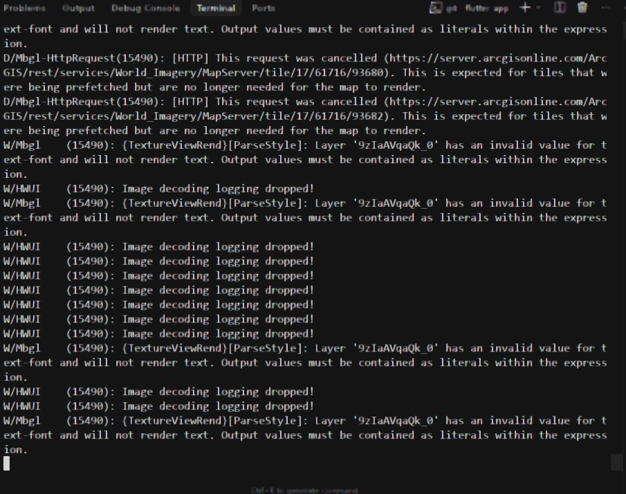
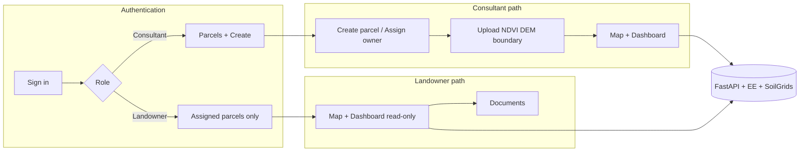
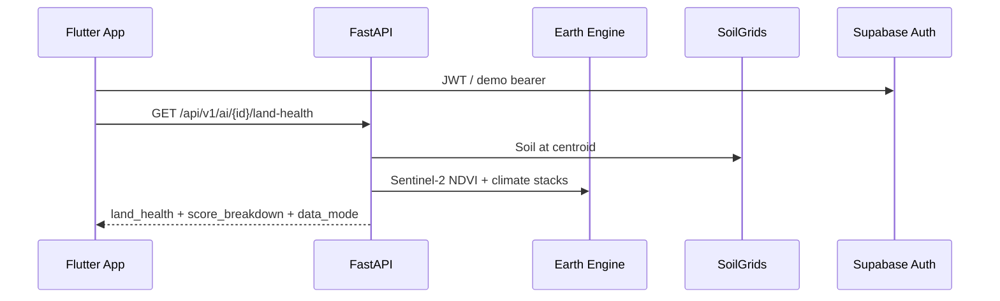
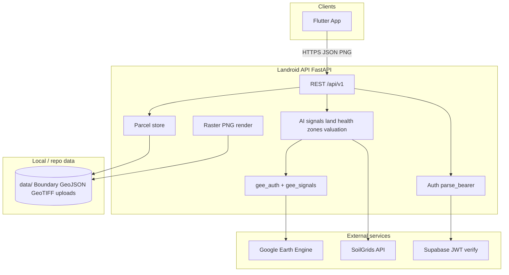
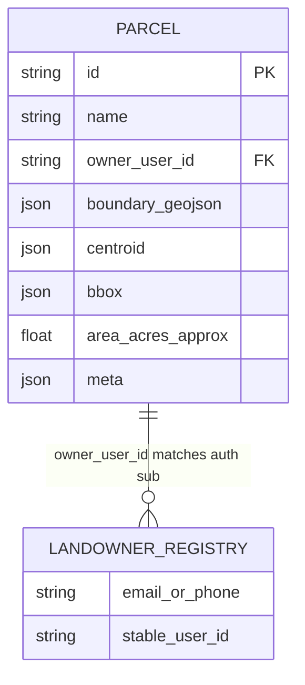

<div align="center">

# Landroid

**Land intelligence for consultants and landowners** — satellite NDVI, climate signals, GIS maps, and valuation in one Flutter app backed by FastAPI, Google Earth Engine, and Supabase-ready auth.

[](https://flutter.dev/)
[](https://fastapi.tiangolo.com/)
[](https://supabase.com/)
[](https://earthengine.google.com/)

[Quick start](#-quick-start) · [Architecture](#-system-architecture) · [API](#-api-architecture) · [Screenshots](#-product-tour-screenshots)

</div>

---

## Table of contents

1. [Overview](#-overview)
2. [Product tour (screenshots)](#-product-tour-screenshots)
3. [User flows](#-user-flows)
4. [Tech stack](#-tech-stack)
5. [System architecture](#-system-architecture)
6. [API architecture](#-api-architecture)
7. [Data & schema](#-data--schema)
8. [Hackathon alignment](#-hackathon--srs-alignment)
9. [Earth Engine (live NDVI)](#-real-time--earth-engine)
10. [Quick start](#-quick-start)
11. [Docs](#-additional-documentation)

---

## Overview

**Landroid** is a full-stack prototype for **SRS FR**-style land workflows:

- **Land Consultant** creates parcels, assigns landowners, uploads Birdscale outputs (GeoTIFF / boundary GeoJSON), and reviews AI signals.
- **Landowner** sees a **read-only** map, dashboard (land health, zones, valuation), and document vault for assigned parcels only.
- **Dashboard** combines **Sentinel-2** NDVI (via Earth Engine), **CHIRPS** rainfall, **ERA5-Land** temperature, and **SoilGrids** soil — with transparent **“Why this score?”** weights (FR-22 composite).
- **Map** uses **MapLibre** with satellite/street basemap, boundary, NDVI/zones overlays, optional orthomosaic/DEM tiles, and **tap-to-measure** path length & area.

---

## Product tour (screenshots)

Place additional exports in [`snapshots/`](snapshots/); paths below match the current repo.

### Authentication & roles

| | |
|:--|:--|
| **Sign in** — Supabase or demo tokens (`demo-consultant`, `demo-owner`). |  |
| **Consultant home** — parcels list, create parcel, role banner. |  |
| **Landowner home** — assigned parcel focus, read-only hints. |  |

### Dashboard & intelligence

| | |
|:--|:--|
| **Land Consultant Dashboard** — health score, signal cards, trends. |  |
| **Valuation & advisory** — valuation band and consultant advisory strip. |  |

### GIS & parcels

| | |
|:--|:--|
| **GIS layers & filters** — basemap, boundary, NDVI, zones, measure, boundary metrics. |  |
| **Parcel assign** — create parcel and assign landowner. |  |

### Documents & settings

| | |
|:--|:--|
| **Document vault** — parcel documents and downloads. |  |
| **Clear cache** — on-device map/dashboard cache controls. |  |

### Backend (ops)

| | |
|:--|:--|
| **API / dev** — FastAPI, health, logs (example). |  |

---

## User flows





---

## Tech stack

| Layer | Technology | Notes |
|--------|------------|--------|
| **Mobile / Web UI** | Flutter 3.x, Material 3 | MapLibre GL, `fl_chart`, liquid-glass style cards |
| **API** | FastAPI, Uvicorn, Pydantic | CORS enabled; `/api/v1` prefix |
| **Geo / RS** | Google Earth Engine Python API | Sentinel-2 SR harmonized, masks, composites |
| **Raster** | Rasterio / Pillow (server) | NDVI/zones/DEM PNG overlays |
| **Soil** | ISRIC SoilGrids (HTTP) | Point summaries at parcel centroid |
| **Auth** | Supabase JWT (optional) + demo bearers | `Authorization: Bearer` |
| **Data (prototype)** | In-memory parcel store + `data/` GeoJSON & GeoTIFF | Swap for Postgres/PostGIS for production |

---

## System architecture

High-level context: client talks to **one API**; the API pulls **external intelligence** and local files.



---

## API architecture

Logical grouping of routes (all under host root; JSON unless noted).

```mermaid
flowchart LR
  subgraph Health["Health"]
    H1["GET /healthz"]
  end

  subgraph Parcels["Parcels"]
    P1["POST /api/v1/parcels"]
    P2["GET /api/v1/parcels"]
    P3["GET /api/v1/parcels/{id}"]
    P4["POST .../assets/*"]
    P5["GET .../map-manifest"]
    P6["GET .../layers/*.png"]
  end

  subgraph AI["AI"]
    A1["GET .../land-health"]
    A2["GET .../plant-zones"]
    A3["GET .../valuation"]
  end

  subgraph Docs["Documents"]
    D1["GET .../documents"]
    D2["GET .../gis-snapshot-report"]
  end

  Health --- Parcels
  Parcels --- AI
  AI --- Docs
```



**Selected endpoints**

| Method | Path | Purpose |
|--------|------|---------|
| `GET` | `/healthz` | Liveness + Earth Engine / data dir flags |
| `GET` | `/api/v1/parcels` | List parcels for current role |
| `POST` | `/api/v1/parcels` | Create parcel + assign owner |
| `GET` | `/api/v1/parcels/{id}/map-manifest` | GIS layer URLs, bbox, `parcel_metrics`, health snapshot |
| `GET` | `/api/v1/parcels/{id}/layers/ndvi.png` | NDVI raster overlay PNG + `X-Geo-Bounds` |
| `GET` | `/api/v1/ai/{id}/land-health` | Composite score, `score_breakdown`, `data_mode` |
| `GET` | `/api/v1/ai/{id}/valuation` | Valuation band using land health |
| `POST` | `/api/v1/parcels/{id}/assets/boundary` | Replace boundary GeoJSON |

---

## Data & schema

### Prototype backend model (in-memory)

The hackathon server keeps parcels in process memory (`ParcelStore`). Conceptual entity:



> **Production note:** Replace `ParcelStore` with a durable database (e.g. PostgreSQL + PostGIS for boundaries). Supabase already fits **auth**; add a `parcels` table with RLS by `owner_user_id`.

### Supabase (auth)

| Concept | Usage |
|---------|--------|
| `auth.users` | Managed by Supabase |
| JWT claims | `sub`, `email`, app metadata for role (`landowner` / `consultant`) |
| Flutter | `supabase_flutter` + `--dart-define` for URL/anon key |

### External datasets (read-only APIs)

| Source | Data |
|--------|------|
| **Earth Engine** | Sentinel-2 NDVI composites, CHIRPS, ERA5-Land |
| **SoilGrids** | pH, SOC, texture at centroid |

---

## Hackathon / SRS alignment

| Area | What to demo |
|------|----------------|
| **AI (NDVI + confidence)** | Land health from **Earth Engine** when configured; **confidence %** and **“Why this score?”** (FR-22 weights + subscores). |
| **GIS / map** | MapLibre: boundary, NDVI/zones PNGs, basemap, tap measure, boundary metrics from manifest. |
| **UI/UX** | Liquid-glass style cards, **English / Tamil**, consultant vs landowner UX. |
| **Security** | Supabase keys via **`--dart-define`**; secrets not committed — see `backend/.env.example`. |

---

## Real-time / Earth Engine

1. **Backend:** Set `GEE_PROJECT_ID` (or `GOOGLE_CLOUD_PROJECT`), service account JSON (`GOOGLE_APPLICATION_CREDENTIALS` or `GEE_SERVICE_ACCOUNT_KEY_PATH`), and register the SA on [Earth Engine](https://code.earthengine.google.com/register).
2. **Default:** `LANDROID_ALLOW_SYNTHETIC_LAND_HEALTH` defaults to **`false`** — live EE when initialization succeeds. For **offline UI only**, set `LANDROID_ALLOW_SYNTHETIC_LAND_HEALTH=true` in `backend/.env`.
3. **Verify:** `GET http://localhost:8000/healthz` → `earth_engine_initialized: true`.
4. **App:** Pull-to-refresh on Dashboard; cached synthetic rows are skipped once EE data exists.

Map NDVI **PNG** is rendered from your **GeoTIFF** (or API placeholder); dashboard **numbers** come from the EE time-series pipeline.

---

## Quick start

### Backend

```bash
cd backend
python -m venv .venv
.venv\Scripts\activate   # Windows
pip install -r requirements.txt
copy .env.example .env   # fill GEE + optional flags
uvicorn app.main:app --reload --host 0.0.0.0 --port 8000
```

### Flutter

```bash
cd flutter_app
flutter pub get
flutter run --dart-define=SUPABASE_URL=https://YOUR_REF.supabase.co ^
  --dart-define=SUPABASE_ANON_KEY=your_anon_key
```

**Demo API tokens** (no Supabase): `demo-consultant`, `demo-owner` as `Authorization: Bearer …`.

---

## Additional documentation

- `docs/validation-matrix.md` — requirement traceability (if present)
- `docs/evaluation-runbook.md` — evaluation steps (if present)
- `backend/.env.example` — environment variable reference

---

<div align="center">

**Landroid** — *from boundary to intelligence, in one flow.*

</div>
