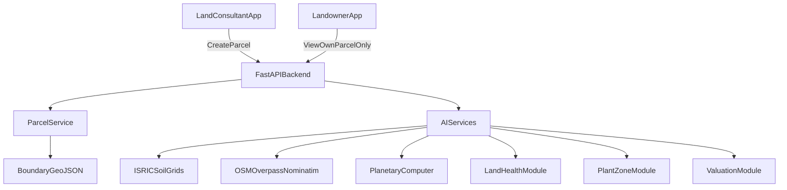

# Architecture Overview

## Responsibilities

- Mobile app: role-based UI, map view, confidence display, clear cache action.
- Backend: token gate, role checks, parcel authorization, AI computation orchestration.
- Evidence docs: mandatory/desirable judge-proof checklist and runbook.
