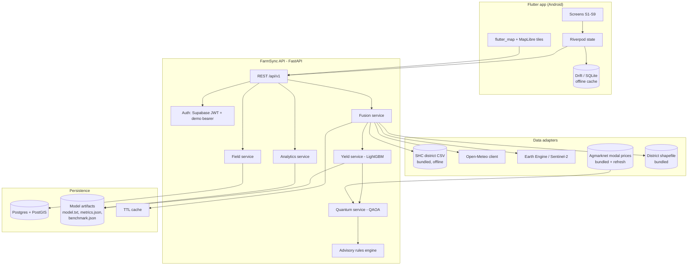
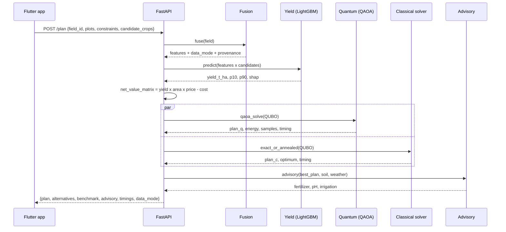
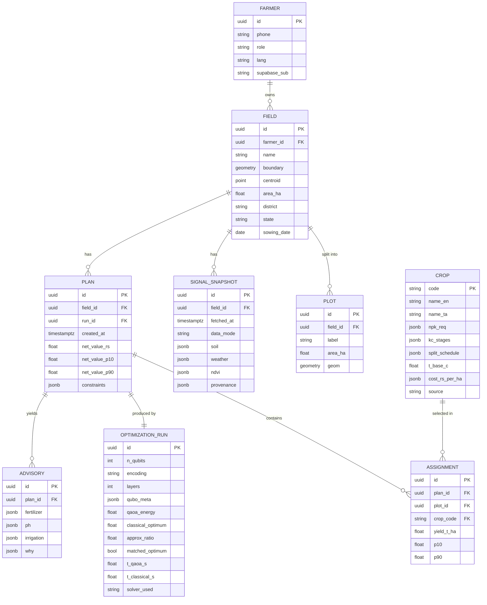

# FarmSync — Technical Requirements Document

**Project:** FarmSync (Quantum 2.0 hackathon, problem QT-2.14)
**Status:** v1.0 — build spec
**Companion docs:** [`PRD.md`](PRD.md) · [`FARMSYNC_BRIEF.md`](FARMSYNC_BRIEF.md)
**Stack decision:** Flutter (mobile) + FastAPI (backend), mirroring the proven Landroid layout

---

## 1. Scope

This document specifies how to build every **M**-priority requirement in the PRD. Where the PRD says *what*, this says *how*, with the formulations, protocols, and contracts fixed so that three people can work in parallel without colliding.

**Non-goals, restated for engineers:** no quantum hardware execution, no quantum model on the prediction path, no marketplace module, no IoT ingestion path, no real-money transactions.

---

## 2. System architecture



**Request flow for the money path (`POST /api/v1/plan`):**



---

## 3. Data adapters

Every adapter implements the same interface: return a typed Pydantic model, a `source` string, a `fetched_at` timestamp, and never raise to the caller — on failure return `None` and let the fusion service downgrade `data_mode`.

### 3.1 Soil — Soil Health Card (offline-first)

- **Origin:** Soil Health Card district-level nutrient status (`soilhealth.dac.gov.in`) + state agriculture department datasets.
- **Runtime dependency: none.** The data is scraped/downloaded **once**, cleaned, and committed as `backend/data/soil/shc_districts.csv`. The API never calls the portal at request time. This is deliberate — the portal is unreliable and a demo cannot depend on it.
- **Schema:** `state, district, n_kg_ha, p_kg_ha, k_kg_ha, ph, oc_pct, ec_ds_m, year, source_url`
- **Lookup:** field centroid → district via bundled shapefile (`district_boundaries.geojson`, simplified, shapely `contains`) → CSV row.
- **Rating classes** (ICAR / SHC standard, used for both UI chips and the fertilizer adjustment factor):

| Nutrient | Low | Medium | High |
|---|---|---|---|
| Available N (kg/ha) | < 280 | 280–560 | > 560 |
| Available P (Olsen, kg/ha) | < 10 | 10–25 | > 25 |
| Available K (kg/ha) | < 120 | 120–280 | > 280 |

- **Override:** `POST /api/v1/fields/{id}/soil-override` accepts farmer-supplied SHC values; overrides win and are marked `source: "farmer_shc"`.

### 3.2 Weather — Open-Meteo

- **Endpoints:** Archive API for season-to-date, Forecast API for the next 7 days. No API key.
- **Daily variables:** `temperature_2m_max`, `temperature_2m_min`, `temperature_2m_mean`, `relative_humidity_2m_mean`, `precipitation_sum`, `et0_fao_evapotranspiration`.
- **Window:** sowing date (farmer-entered) → today; fallback to a fixed season window per the season config.
- **Cache TTL:** 6 h forecast, 24 h archive.
- **Fallback:** NASA POWER daily point API if Open-Meteo fails.

### 3.3 Crop health — Sentinel-2 NDVI

- **Source:** Google Earth Engine, `COPERNICUS/S2_SR_HARMONIZED`. The Landroid backend already has working GEE service-account auth — reuse `gee_auth.py` unchanged.
- **Cloud masking:** SCL band, drop classes 3 (shadow), 8/9/10 (clouds, cirrus); additionally filter `CLOUDY_PIXEL_PERCENTAGE < 40`.
- **NDVI:** `(B8 − B4) / (B8 + B4)`, reduced over the boundary polygon.
- **Fallback:** Copernicus Data Space Sentinel Hub Statistical API if GEE quota is hit.
- **Degradation rule:** fewer than 2 clear scenes in the window → NDVI features emitted as `null`, `data_mode = "degraded"`. LightGBM consumes NaN natively; no imputation is performed, because imputing would silently fabricate a signal.
- **Overlay:** NDVI rendered server-side to PNG with an `X-Geo-Bounds` header — same pattern as Landroid's `/layers/ndvi.png`.

### 3.4 Prices — Agmarknet

- Bundled `backend/data/prices/modal_prices.csv` (`crop, district, modal_price_rs_per_quintal, date`), refreshed opportunistically when online. Farmer-overridable (FR-71). Prices are an **input assumption**, always displayed, never presented as a forecast.

---

## 4. Feature engineering

Single source of truth: `backend/app/ml/features.py`. **The same function builds training rows and inference rows.** Any divergence here is a training/serving skew bug and the most likely cause of a demo-day surprise.

| Feature | Source | Notes |
|---|---|---|
| `n_kg_ha`, `p_kg_ha`, `k_kg_ha`, `ph`, `oc_pct` | SHC | district baseline or farmer override |
| `rainfall_cum_mm` | Open-Meteo | sowing → today |
| `rainfall_last30_mm` | Open-Meteo | recent-stress signal |
| `dry_spell_max_days` | Open-Meteo | longest run of days with < 2.5 mm |
| `temp_mean_c`, `temp_max_c` | Open-Meteo | season aggregates |
| `gdd` | Open-Meteo | Σ max(0, T_mean − T_base), T_base per crop from `crops.yaml` |
| `humidity_mean_pct` | Open-Meteo | disease-pressure proxy |
| `et0_cum_mm` | Open-Meteo | water-demand proxy |
| `ndvi_mean`, `ndvi_max`, `ndvi_p90` | Sentinel-2 | nullable |
| `ndvi_slope_30d` | Sentinel-2 | OLS slope over last 30 days; stress indicator; nullable |
| `ndvi_auc` | Sentinel-2 | trapezoidal integral ≈ cumulative biomass; nullable |
| `area_ha` | geometry | from boundary polygon |
| `crop` | categorical | LightGBM native categorical |
| `district`, `state` | categorical | **excluded from the temporal-holdout model** to prevent memorisation; ablation reported |
| `season` | categorical | kharif / rabi / samba / kuruvai |

---

## 5. Yield model

### 5.1 Training data

- **Primary:** [ICRISAT District Level Database](http://data.icrisat.org/dld/) — district × year × crop area/production/yield for India, plus fertilizer consumption and rainfall. This is the right backbone: long panel, district granularity, and it aligns with the district granularity of the SHC data.
- **Supplements:** [`data.gov.in` district-wise crop production](https://aikosh.indiaai.gov.in/), FAOSTAT for cross-checks.
- **Weather join:** Open-Meteo Archive back-fill at each district centroid for the corresponding season.
- **NDVI join:** Sentinel-2 exists only from 2015 onward. Rows before 2015 carry `ndvi_* = NaN`. This is honest and LightGBM handles it — and it doubles as the degraded-mode training signal.

### 5.2 Model

```
LGBMRegressor(
  objective="regression_l1",   # MAE — robust to district-level outliers
  n_estimators=1200, learning_rate=0.03,
  num_leaves=31, min_child_samples=40,
  subsample=0.8, colsample_bytree=0.8,
  reg_lambda=1.0, random_state=42,
)
```

Two extra quantile models at `alpha=0.10` and `alpha=0.90` (`objective="quantile"`) give the P10–P90 prediction interval required by FR-31. Three artifacts, one feature list.

### 5.3 Evaluation protocol — the part that decides the 35%

Three protocols are run and **all three are reported**:

| Protocol | Method | Purpose |
|---|---|---|
| **P1 — random split** | 80/20 `train_test_split(random_state=42)` | Comparable to what other teams will report; the ≈0.90 R² figure |
| **P2 — grouped CV** | `GroupKFold(n_splits=5, groups=district)` | Removes district memorisation. The honest generalisation number |
| **P3 — temporal holdout** | train ≤ 2020, test ≥ 2021 | Simulates actual deployment: predicting a season you haven't seen |

**Baselines** reported alongside, in the same table:

1. Global mean
2. District × crop historical mean
3. Ridge regression on the same features

The claim made on stage is *"LightGBM reduces RMSE by X% over the district-crop mean baseline under temporal holdout"* — a lift over a real baseline, not a bare R².

**Leakage checklist**, enforced as a unit test:

- No `production` or `area` columns from the target year in the feature set (yield = production/area — this is the classic leak, and it is the one a judge will probe).
- No future weather beyond the prediction date.
- District encoding excluded from P3.
- Duplicate (district, year, crop) rows deduplicated before splitting.

### 5.4 Artifacts and serving

`backend/models/<version>/` containing:

| File | Contents |
|---|---|
| `yield_lgbm.txt` | LightGBM booster |
| `yield_q10.txt`, `yield_q90.txt` | quantile boosters |
| `feature_list.json` | ordered feature names + dtypes — validated at load |
| `metrics.json` | P1/P2/P3 metrics, baselines, per-crop RMSE, training date, row count, git SHA |
| `shap_global.json` | global mean absolute SHAP per feature |
| `crops.yaml` | agronomic reference (below) |

`GET /api/v1/analytics/model-metrics` serves `metrics.json` **verbatim**. FR-33 forbids a hardcoded metric anywhere in the Flutter app; a CI grep for float literals in the analytics widgets enforces it.

Per-prediction SHAP via `TreeExplainer`, computed on demand (< 20 ms at this model size).

---

## 6. Quantum optimiser

### 6.1 The problem

Given a field split into plots `p = 1..P`, candidate crops `c = 1..C`, and farmer constraints, choose one crop per plot to maximise net value subject to water, land, and budget limits.

Binary variable `x_i ∈ {0,1}` for each candidate `i = (p, c)`, so `n_dec = P × C`.

**Objective coefficient** (the net-value matrix, FR-41):

```
v_i = ŷ_(p,c) [t/ha] × area_p [ha] × price_c [₹/t] − cost_(p,c) [₹]
```

where `ŷ` comes from the LightGBM model and `cost` sums seed, fertilizer, and labour from `crops.yaml`.

**Constraints:**

| # | Constraint | Form |
|---|---|---|
| C1 | Exactly one crop per plot | `Σ_{c} x_(p,c) = 1` ∀p |
| C2 | Water budget | `Σ_i w_i x_i ≤ W` |
| C3 | Cash budget | `Σ_i cost_i x_i ≤ B` |

### 6.2 QUBO construction

Coefficients are normalised to `[0,1]` before penalty assembly (`v'_i = v_i / max_j|v_j|`) so that penalty weights are scale-free and tunable once.

**Minimise:**

```
H(x) = − Σ_i v'_i x_i
       + λ₁ Σ_p ( Σ_c x_(p,c) − 1 )²                    ← C1, equality, no slack needed
       + λ₂ ( Σ_i w'_i x_i + Σ_{k=0}^{K_w-1} 2^k s_k − W' )²   ← C2, slack-encoded inequality
       + λ₃ ( Σ_i b'_i x_i + Σ_{k=0}^{K_b-1} 2^k t_k − B' )²   ← C3
```

- Slack bits `K = ⌈log₂(bound + 1)⌉` after discretising the constraint budget.
- **Penalty rule (unit-tested):** `λ > max_i |v'_i| + ε`, which guarantees no infeasible assignment can beat a feasible one. With normalisation this means `λ ≈ 1.5` works across instances instead of being hand-tuned per demo.
- **Slack-free alternative:** unbalanced penalisation encodes inequalities without slack qubits at the cost of exactness. Implemented behind a flag (`ENCODING=slack|unbalanced`) — it is the lever that keeps qubit count at `n_dec` if the simulator gets slow. Report which encoding produced each benchmark row.

**Ising mapping** via `x_i = (1 − z_i)/2`, giving `H = const + Σ_i h_i Z_i + Σ_{i<j} J_ij Z_i Z_j` with

```
h_i  = −½ Q_ii − ¼ Σ_{j≠i} Q_ij
J_ij =  ¼ Q_ij
const = ½ Σ_i Q_ii + ¼ Σ_{i<j} Q_ij
```

### 6.3 Instance sizes

| Tier | Plots × Crops | Slack bits | **Qubits** | Brute-forceable | Use |
|---|---|---|---|---|---|
| A | 3 × 2 | 0 (unbalanced) | **6** | yes (64) | Fast path, live demo |
| B | 3 × 2 | 3 (water) | **9** | yes (512) | Headline benchmark — matches the brief's 6–9 qubit range |
| C | 4 × 3 | 4 | **16** | yes (65,536) | Scaling table |
| D | 5 × 4 | 5 | **25** | no (33 M — 40+ min) | The "where classical stops being free" slide |

### 6.4 QAOA specification (PennyLane)

| Parameter | Value | Rationale |
|---|---|---|
| Device | `default.qubit` | Analytic expectation for the optimiser; shot-based for sampling |
| Layers `p` | 3 | Diminishing returns past 3 at this size; ablation over p ∈ {1,2,3,4} reported |
| Initial state | `H^⊗n` (uniform superposition) | Standard |
| Cost layer | `qml.qaoa.cost_layer(γ, H_C)` | From the Ising coefficients |
| Mixer | `qml.qaoa.mixer_layer(β, Σ X_i)` | Transverse-field |
| Classical optimiser | COBYLA, 200 iters; Adam (lr 0.05, 150 steps) as a cross-check | Both reported |
| Parameter init | Linear ramp γ ∈ [0, 0.5], β ∈ [0.5, 0] | Beats random init reliably |
| Objective | **CVaR at α = 0.25** rather than mean energy | Well-established improvement for combinatorial QAOA — optimising the best quartile of samples, since we only need one good bitstring |
| Sampling | 2048 shots from the trained circuit | |
| Selection | Filter samples to feasible, take minimum energy | An infeasible bitstring is never returned as a plan |

### 6.5 Classical comparison and fallback

`quantum/classical_fallback.py` provides:

- `brute_force(qubo)` — exhaustive for `n ≤ 20`, gives the exact optimum
- `simulated_annealing(qubo)` — for larger `n`

**Both** are run on every request (FR-44). The response returns the QAOA plan and the classical plan side by side. If QAOA exceeds `QAOA_TIMEOUT_S = 10`, the response carries the classical plan with `solver: "classical_fallback"` and `quantum_status: "timeout"` — the farmer's plan never depends on the simulator finishing (FR-46).

### 6.6 Benchmark protocol

`scripts/benchmark_qaoa.py` → `models/<version>/benchmark.json`, served at `GET /api/v1/analytics/quantum-benchmark`.

50 randomly generated instances per tier. Recorded per instance:

| Metric | Definition |
|---|---|
| `optimum_match` | best feasible QAOA sample energy == brute-force optimum |
| `approximation_ratio` | `E_best_sampled / E_optimum` |
| `p_optimum` | probability mass on optimal bitstring(s) in the QAOA distribution |
| `uplift_vs_uniform` | `p_optimum / (num_optima / 2ⁿ)` — **the quantified form of "QAOA biases the distribution"** |
| `feasible_rate` | fraction of the 2048 samples satisfying all constraints |
| `t_qaoa_s`, `t_classical_s` | wall clock, both |

Targets: `optimum_match ≥ 90%`, mean `approximation_ratio ≥ 0.98`, `uplift_vs_uniform ≥ 20×`, `feasible_rate ≥ 95%`.

`benchmark.json` carries a literal string field that the UI renders verbatim:

> `"claim": "Simulated QAOA recovers the exact optimum at demo scale. No runtime advantage over classical is claimed or observed at n ≤ 25 qubits."`

Nobody has to remember the honest phrasing under pressure — it is on the screen.

---

## 7. Advisory rules engine

Deterministic, auditable, no ML. Every output carries the inputs that produced it (FR-54).

### 7.1 Fertilizer (FR-50)

**Step 1 — requirement.** Per-crop N-P₂O₅-K₂O recommendation from `crops.yaml`, sourced from the TNAU Crop Production Guide / ICAR package of practices. Values are config, not code, and each entry carries its `source` string so a judge can be pointed at the reference.

**Step 2 — soil adjustment.** From the SHC rating class:

| Class | Factor |
|---|---|
| Low | 1.25 × |
| Medium | 1.00 × |
| High | 0.75 × |

**Step 3 — straight-fertilizer conversion.** Grade content is config (`fertilizers.yaml`), because bag mass and grades change:

| Product | Content | Bag |
|---|---|---|
| Urea | 46% N | 45 kg |
| DAP | 18% N, 46% P₂O₅ | 50 kg |
| MOP | 60% K₂O | 50 kg |

```
DAP_kg   = P₂O₅_req / 0.46
N_in_DAP = DAP_kg × 0.18
Urea_kg  = max(0, (N_req − N_in_DAP)) / 0.46
MOP_kg   = K₂O_req / 0.60
bags     = ceil(kg / bag_mass_kg)      ← the farmer buys bags, not kilograms
```

**Step 4 — split schedule.** Per-crop stage splits from `crops.yaml` (e.g. paddy: 50% basal, 25% tillering, 25% panicle initiation), rendered as dated tasks from the sowing date.

### 7.2 pH correction (FR-51)

| Soil pH | Advice |
|---|---|
| < 5.5 | Strongly acidic — lime 2–3 t/ha, apply 3–4 weeks before sowing |
| 5.5–6.5 | Slightly acidic — lime 1–2 t/ha |
| 6.5–7.5 | Optimal — no amendment |
| 7.5–8.5 | Alkaline — organic matter, gypsum only if sodicity confirmed |
| > 8.5 | Likely sodic — gypsum 2–5 t/ha, subject to a gypsum-requirement test |

Every pH card carries a mandatory caveat: *these are district-level indicative values; confirm with a soil test before applying amendments at cost.* Non-removable string.

### 7.3 Irrigation (FR-52)

```
ETc  = Kc(crop, stage) × ET₀            ← ET₀ from Open-Meteo, Kc from crops.yaml
Pe   = P(125 − 0.2P)/125   if P < 250 mm      ← USDA-SCS effective rainfall (monthly)
     = 125 + 0.1P          if P ≥ 250 mm
NIR  = max(0, ETc − Pe)
```

Surfaced as "your crop needs ~X mm this week; rain will supply ~Y; irrigate ~Z mm."

---

## 8. API specification

Base `/api/v1`. Bearer auth on everything except `/healthz`. All responses carry `data_mode`, `request_id`, and `timings`.

### Health & auth

| Method | Path | Notes |
|---|---|---|
| `GET` | `/healthz` | Liveness + `{earth_engine_initialized, model_loaded, model_version, demo_mode}` |
| `POST` | `/auth/otp/start` · `/auth/otp/verify` | Supabase phone OTP proxy |

Demo bearers `demo-farmer` / `demo-officer` bypass Supabase — same pattern as Landroid.

### Fields

| Method | Path | Notes |
|---|---|---|
| `GET` | `/fields` | Role-scoped list |
| `POST` | `/fields` | `{name, boundary_geojson, plots[], sowing_date}` → derives centroid, bbox, area, district |
| `GET` | `/fields/{id}` | |
| `PUT` | `/fields/{id}/boundary` | Replace polygon; invalidates cached signals |
| `POST` | `/fields/{id}/soil-override` | Farmer's own SHC values |
| `DELETE` | `/fields/{id}` | |

### Signals

| Method | Path | Notes |
|---|---|---|
| `GET` | `/fields/{id}/signals` | Fused soil + weather + NDVI with per-value `source` and `fetched_at` |
| `GET` | `/fields/{id}/layers/ndvi.png` | Overlay PNG, `X-Geo-Bounds` header |
| `GET` | `/fields/{id}/ndvi-series` | Time series for the season chart |

### Prediction, planning, advisory

| Method | Path | Notes |
|---|---|---|
| `POST` | `/predict/yield` | `{field_id, crops[]}` → per crop `{yield_t_ha, p10, p90, shap[], confidence}` |
| `POST` | `/plan` | **The money endpoint.** `{field_id, plots[], candidate_crops[], constraints:{water_m3, budget_rs}, price_overrides?}` |
| `GET` | `/fields/{id}/advisory` | Fertilizer bags + schedule, pH, irrigation |

`POST /plan` response shape:

```jsonc
{
  "plan": {
    "solver": "qaoa",                  // or "classical_fallback"
    "assignments": [{"plot_id":"p1","crop":"paddy","yield_t_ha":5.2,"p10":4.4,"p90":6.1}],
    "net_value_rs": 142000,
    "net_value_p10_rs": 118000,
    "net_value_p90_rs": 163000,
    "water_used_m3": 4200, "budget_used_rs": 31500
  },
  "alternatives": { "classical": { "assignments": [...], "net_value_rs": 142000 } },
  "benchmark": {
    "n_qubits": 9, "encoding": "slack", "qaoa_layers": 3, "qubo_terms": 47,
    "qaoa_energy": -0.884, "classical_optimum": -0.884,
    "approximation_ratio": 1.0, "matched_optimum": true,
    "p_optimum": 0.31, "uplift_vs_uniform": 158.7,
    "feasible_rate": 0.97, "t_qaoa_s": 4.1, "t_classical_s": 0.002,
    "claim": "Simulated QAOA recovers the exact optimum at demo scale. No runtime advantage over classical is claimed or observed at n ≤ 25 qubits."
  },
  "advisory": { "fertilizer": {...}, "ph": {...}, "irrigation": {...} },
  "data_mode": "live",
  "timings": {"fusion_ms":1840,"predict_ms":112,"qaoa_ms":4100,"classical_ms":2,"advisory_ms":6}
}
```

The `timings` block is not instrumentation vanity — it is shown on the analytics screen and answers the "how long does the quantum part take" question before it is asked.

### Analytics

| Method | Path | Notes |
|---|---|---|
| `GET` | `/analytics/model-metrics` | `metrics.json` verbatim |
| `GET` | `/analytics/feature-importance` | Global SHAP |
| `GET` | `/analytics/yield-vs-rainfall` | Scatter points for the chart |
| `GET` | `/analytics/quantum-benchmark` | `benchmark.json` verbatim |
| `GET` | `/prices` | `?crop=&district=` |

---

## 9. Data model



Postgres + PostGIS (Supabase free tier). Row-level security by `farmer_id = auth.uid()`. **Do not repeat Landroid's in-memory `ParcelStore`** — plans and optimisation runs must survive a restart, because the demo depends on a pre-seeded field being there.

---

## 10. Mobile app architecture

```
flutter_app/lib/
  main.dart
  core/            env.dart, api_client.dart (dio + retry + auth interceptor),
                   result.dart, connectivity.dart
  l10n/            app_en.arb, app_ta.arb          ← every farmer string, no exceptions
  data/
    models/        field, signals, plan, advisory, benchmark (freezed + json_serializable)
    repos/         field_repo, signals_repo, plan_repo, analytics_repo
    local/         drift database — cached signals, plans, advisories
  features/
    auth/  fields/  field_editor/  field_detail/
    constraints/  plan/  advisory/  analytics/  settings/
  widgets/         health_chip, data_mode_badge, why_this_sheet,
                   uncertainty_band_chart, shap_bar_chart, ndvi_series_chart
```

| Concern | Choice |
|---|---|
| State | Riverpod (`AsyncNotifier` per feature) |
| Navigation | `go_router` |
| Map | `flutter_map` + MapLibre raster tiles + `flutter_map_geojson` (already proven in Landroid; avoids the native MapLibre build issues) |
| Charts | `fl_chart` |
| Local DB | `drift` |
| i18n | `flutter_localizations` + ARB |
| Secrets | `--dart-define` only. Never in `pubspec.yaml`, never committed (NFR-07) |

**Offline behaviour (NFR-05):** every successful response is written to Drift with a `fetched_at`. On network failure the repo returns the cached row wrapped in `Result.stale(data, age)`, and the UI shows an amber "showing saved data from N hours ago" banner. The Plan and Advisory screens are fully functional offline against the last plan. This is a rural-India requirement first and a demo-safety net second.

**Build note (from `build_log.txt`):** the Windows build failed because the pub cache path contained a space (`C:\Users\Anto Merary`). `PUB_CACHE` is pinned to a space-free directory in `run_android.ps1`, and `.pub-cache/` is already gitignored. Build and sideload the APK **at least 24 hours before the demo.**

---

## 11. Repository layout

```
farmsync/
├── backend/
│   ├── app/
│   │   ├── main.py
│   │   ├── core/            config.py  security.py  cache.py  logging.py
│   │   ├── api/v1/          health.py  auth.py  fields.py  signals.py
│   │   │                    predict.py  plan.py  advisory.py  analytics.py
│   │   ├── adapters/        soil_shc.py  weather_openmeteo.py  ndvi_gee.py
│   │   │                    prices_agmarknet.py  district_lookup.py
│   │   ├── services/        fusion.py  yield_service.py  plan_service.py  advisory.py
│   │   ├── ml/              features.py  train.py  yield_model.py  explain.py
│   │   ├── quantum/         qubo.py  quantum_optimizer.py
│   │   │                    classical_fallback.py  benchmark.py
│   │   ├── db/              models.py  session.py  migrations/
│   │   └── schemas/         pydantic models
│   ├── data/                soil/  prices/  geo/  fixtures/
│   ├── models/<version>/    yield_lgbm.txt  metrics.json  benchmark.json  crops.yaml
│   ├── scripts/             build_training_set.py  train_model.py
│   │                        benchmark_qaoa.py  seed_demo.py
│   ├── tests/
│   ├── pipeline.py          ← end-to-end CLI: `python pipeline.py`
│   └── requirements.txt
├── flutter_app/
├── docs/                    PRD.md  TRD.md  FARMSYNC_BRIEF.md
└── notebooks/               eda.ipynb  model_eval.ipynb
```

The three files the brief says already exist — `yield_model.py`, `quantum_optimizer.py`, `pipeline.py` — map to `app/ml/yield_model.py`, `app/quantum/quantum_optimizer.py`, and `backend/pipeline.py`. Move them into this layout rather than rewriting; `pipeline.py` stays runnable standalone as the fastest possible "does it work" check.

---

## 12. Non-functional implementation

| NFR | Implementation |
|---|---|
| NFR-01 (<150 ms predict) | Booster loaded once at startup into app state; no per-request disk I/O |
| NFR-02 (<8 s plan) | Signals cached; QAOA memoised on `hash(qubo_coefficients)` — an unchanged constraint set replays instantly |
| NFR-03 (<12 s cold) | Soil + weather + NDVI fetched concurrently with `asyncio.gather` |
| NFR-05 (offline) | Drift cache + `Result.stale` (§10) |
| NFR-07 (secrets) | `.env` gitignored; GEE service-account JSON via env path; Flutter via `--dart-define`; `gitleaks` in CI |
| NFR-09 (<₹2/farm) | Open-Meteo free, SHC bundled, GEE free tier, district lookup offline; cost is GEE calls only, TTL-cached at 24 h |
| NFR-10 (demo mode) | `DEMO_MODE=true` → adapters return `data/fixtures/*.json`; `data_mode: "demo"` badge shown honestly, never faked as live |

---

## 13. Testing

| Layer | Tests |
|---|---|
| **QUBO** | Penalty rule holds (no infeasible beats feasible) across 200 random instances; Ising round-trip `energy_qubo(x) == energy_ising(z)`; slack-bit width correctness |
| **QAOA** | Recovers brute-force optimum ≥ 90% at tiers A/B; feasible-rate ≥ 95%; timeout path returns classical plan with correct `solver` field |
| **Yield model** | `metrics.json` regression guard (R² must not drop below a floor); **feature-parity test — training features and inference features are byte-identical for the same row** (the training/serving skew guard); leakage checklist test |
| **Advisory** | Golden tests: known soil + crop → expected bag counts; the pH lab-test caveat is present in every response; Tamil string coverage = 100% |
| **API** | Contract tests per endpoint; every response has `data_mode` and `timings`; auth returns 401/403 correctly for cross-farmer access |
| **Flutter** | Widget tests for the three charts; offline-mode golden test; CI grep asserting no hardcoded metrics in analytics widgets |
| **E2E** | `pipeline.py` run in CI against fixtures — full path from field → plan → advisory |

---

## 14. Deployment

| Component | Target |
|---|---|
| API | Docker image, Render / Fly.io free tier, `uvicorn` behind the platform proxy |
| DB | Supabase Postgres + PostGIS |
| Auth | Supabase phone OTP |
| Model artifacts | Committed under `backend/models/<version>/` — small enough, and it makes the deployment reproducible |
| Cache | In-process `cachetools.TTLCache` (Redis is unnecessary at hackathon scale and adds a failure mode) |
| App | Debug APK sideloaded to the demo phone; no Play Store |

Config (all env, `.env.example` committed with placeholder values only):

```
SUPABASE_URL=            SUPABASE_ANON_KEY=        SUPABASE_JWT_SECRET=
GEE_PROJECT_ID=          GOOGLE_APPLICATION_CREDENTIALS=
DATABASE_URL=            MODEL_VERSION=v1
DEMO_MODE=false          QAOA_TIMEOUT_S=10         QAOA_LAYERS=3
ENCODING=slack           ALLOW_SYNTHETIC=false
```

---

## 15. Observability

- `structlog` JSON logs with `request_id`, `field_id`, `data_mode`, per-stage durations.
- `/healthz` reports `earth_engine_initialized`, `model_loaded`, `model_version`, `demo_mode` — the same at-a-glance flags Landroid uses, and the first thing to check on demo day.
- Every `/plan` call writes an `optimization_run` row, so the quantum panel can be rebuilt from the database if a live run misbehaves.

---

## 16. Demo runbook

**T−24h**
1. `python scripts/train_model.py` → verify `metrics.json` hits the §5.3 targets.
2. `python scripts/benchmark_qaoa.py` → verify `benchmark.json` hits the §6.6 targets.
3. `python scripts/seed_demo.py` → Thanjavur demo field, plots, and one warm plan in the DB.
4. Warm the caches: call `/fields/{demo}/signals` so NDVI is cached and cloud cover can't sabotage you.
5. Build and sideload the APK. Test it on the actual demo phone, on the venue's network if possible.
6. Record the 3-minute fallback video of the full flow.

**T−1h**
- `GET /healthz` → all flags true.
- Airplane-mode test: open app, confirm the last plan and advisory render from cache.
- Set `DEMO_MODE=false`; know the one command that flips it to `true`.

**On stage (6 min)**
1. (0:30) Pitch — §7 of the brief, verbatim.
2. (1:30) Live: add field → constraints → **Get my plan**. Show the timings block.
3. (1:00) Advisory in Tamil — bags of urea, not kg/ha. This is the Practical Impact moment.
4. (1:30) Analytics: three eval protocols, the baseline lift, SHAP. Volunteer that grouped-CV is lower than random-split and explain why. This is the Accuracy moment.
5. (1:00) Quantum panel: QUBO size, qubits, QAOA vs. brute force, `uplift_vs_uniform`, and read the `claim` string off the screen. This is the Innovation moment, and the honesty is the point.
6. (0:30) Roadmap: cooperative-scale allocation and logistics routing, where n outgrows brute force.

**Prepared answers** (one owner, rehearsed):

| Question | Answer |
|---|---|
| "Is it faster than classical?" | No, and we don't claim it. At 9 qubits brute force takes 2 ms. What we claim is a correct QUBO formulation and a solver that stays valid as n grows past the brute-force regime — which is exactly what cooperative-scale allocation looks like. |
| "Why not quantum ML for yield?" | Wrong tool. Yield is tabular regression; gradient boosting dominates there. Putting quantum on the prediction path would have cost us accuracy for a decoration. We put it where the problem is genuinely combinatorial. |
| "Your R² looks too high." | Under a random split, yes — 0.90. That split leaks district identity. Here's the grouped-CV number and here's the temporal holdout, which is the one we'd stand behind in deployment. |
| "Where does soil data come from?" | Government Soil Health Card, district level, bundled offline so the app never depends on that portal. Farmers with their own card can override it. |
| "What if it's cloudy?" | NDVI features go null, `data_mode` flips to degraded, LightGBM handles the missing values natively, and the UI tells the user confidence is reduced. Want to see it? *(Have the toggle ready.)* |

---

## 17. Build order

| Phase | Work | Unblocks |
|---|---|---|
| 0 | Repo scaffold, `.env.example`, `/healthz`, CI | Everything |
| 1 | Adapters (soil, weather, NDVI, district lookup) + `/fields` + `/signals` | The headline data story |
| 2 | `features.py`, `build_training_set.py`, `train_model.py`, `metrics.json` | Accuracy (35%) |
| 3 | `qubo.py`, `classical_fallback.py`, `quantum_optimizer.py`, `benchmark.py` | Innovation (20%) |
| 4 | `/predict/yield`, `/plan`, advisory engine | Practical Impact (20%) |
| 5 | Flutter S1–S7, EN+TA, offline cache | Demo |
| 6 | Flutter S8 analytics + all charts | The other half of the deliverable |
| 7 | Seed script, fixtures, `DEMO_MODE`, recorded video, rehearsal | Presentation (10%) |

Phases 2 and 3 are independent — run them in parallel across the team. Phase 6 is the one most likely to get squeezed, and the brief explicitly says it is half the deliverable, so protect it.

---

## 18. Risk register (technical)

| Risk | Mitigation |
|---|---|
| Training/serving feature skew | One `features.py`, byte-identical parity test in CI (§13) |
| Target leakage via area/production | Explicit leakage test; features frozen in `feature_list.json` |
| QAOA slow on the simulator during demo | Memoised on QUBO hash, warm cache, 10 s timeout, classical fallback |
| Penalty weights mis-tuned → infeasible plans | Normalised coefficients + `λ > max|v'| + ε` rule, unit-tested; feasibility filter on samples |
| GEE quota or auth failure | Copernicus Statistical API fallback; NDVI cached 24 h; degraded-mode path is a demonstrated feature |
| SHC district data missing for the demo district | Bundled CSV validated at startup; startup fails loudly rather than silently serving nulls |
| Flutter build breaks (space in pub cache path) | `PUB_CACHE` pinned; APK built T−24h |
| Model artifact drifts from committed metrics | `metrics.json` carries the git SHA; `/healthz` reports `model_version` |

---

*Companion to [`PRD.md`](PRD.md). Both are subordinate to [`FARMSYNC_BRIEF.md`](FARMSYNC_BRIEF.md).*
